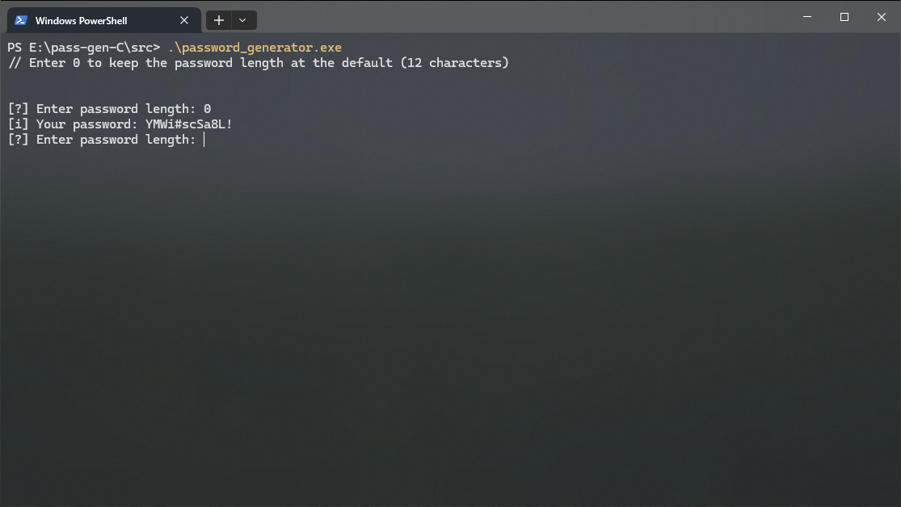

<h1>PASS-GEN-C</h1>

    

<ul>
    <li><b>main.c</b> - it defines user input and an infinite loop</li>
    <li><b>pass_gen.c</b> - it defines functions for password generation</li>
    <li><b>pass_gen.h</b> - is reserved for declaring functions, constants, and some technical details</li>
</ul>
<h1>pass_gen.c</h1>
An array <code>ALPHABET</code> is defined, containing all the necessary characters: uppercase and lowercase Latin letters, numbers and special characters.

The function <code>generate_pass()</code> is defined, which, using <code>rand()</code> and the array <code>ALPHABET</code>, generates a password of a given length. Returns a string - the finished password.

<code>generate_pass()</code> function prototype:
<code>char *generate_pass(uint8_t pass_length);</code>

<h1>pass_gen.h</h1>
It defines the following constants:
<ul>
	<li><b>TRUE</b> - denotes truth (i.e. 1)</li>
	<li><b>PASS_LENGTH</b> - the default password length (as recommended, the value is set to 12)</li>
<ul>

At the same time, <code>stdint.h</code> is included in the header file, since all files use the types that this file defines.

Stack used:

	&nbsp;
	&nbsp;
	&nbsp;
	&nbsp;

<h3>My contacts</h3>
<ul>
    <li> Discord: tetp1sz</li>
    <li> Telegram: @tetp1sz</li>
</ul>
